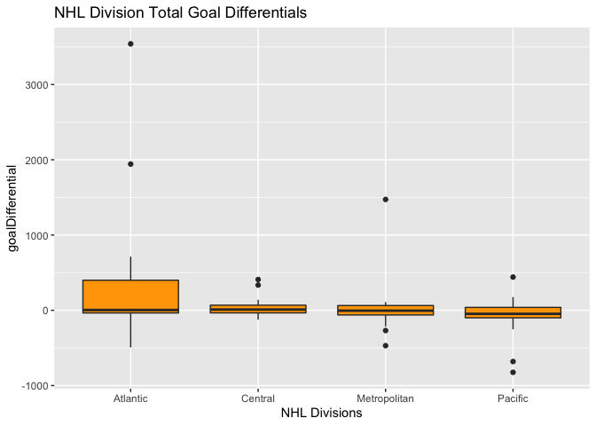

Project 1
================
Kolton Wiebusch
9/15/2020

  - [Purpose](#purpose)
  - [Initial Setup](#initial-setup)
      - [Required Packages](#required-packages)
      - [NHL Records API](#nhl-records-api)
      - [NHL Stats API](#nhl-stats-api)
      - [Wrapper Function](#wrapper-function)
  - [Exploratory Data Analysis](#exploratory-data-analysis)
      - [Joining of Datasets](#joining-of-datasets)
      - [New variables](#new-variables)
      - [Contingency tables](#contingency-tables)
      - [Numerical Summaries](#numerical-summaries)
      - [Plots](#plots)
          - [Aggression Plot](#aggression-plot)
          - [Division Goal Differentials
            Plot](#division-goal-differentials-plot)
          - [St. Louis Blues Skater
            Records](#st.-louis-blues-skater-records)
          - [Regular Season Shutout Percentage by
            Conference](#regular-season-shutout-percentage-by-conference)

# Purpose

The purpose of this project is to create a vignette reading and
summarizing data taken from NHL API’s in order to analyze the data.

# Initial Setup

This first section goes through the behind the scenes work of creating
functions to pull in data for later use

## Required Packages

These are the packages used in this project.

``` r
library(tidyverse)
library(knitr)
library(jsonlite)
library(httr)
```

## NHL Records API

This entails the creating of the functions to call on the NHL records
data

``` r
getFranchise <- function(ID = NULL, ...){
  franchise <- GET("https://records.nhl.com/site/api/franchise")
  franchise <- content(franchise, "text")
  franchise <- fromJSON(franchise, simplifyDataFrame = TRUE, flatten = TRUE)
  franchise <- as.data.frame(franchise)
    if(is.numeric(ID)){
      return(filter(franchise, data.mostRecentTeamId == ID))
    } else if(is.character(ID)){
      return(filter(franchise, data.teamCommonName == ID))
    }
  return(franchise)
} 

getFranchiseTotals <- function(ID = NULL, ...){
  totals <- GET("https://records.nhl.com/site/api/franchise-team-totals")
  totals <- content(totals, "text")
  totals <- fromJSON(totals, simplifyDataFrame = TRUE, flatten = TRUE)
  totals <- as.data.frame(totals)
    if(is.numeric(ID)){
      return(filter(totals, data.franchiseId == ID))
    } else if(is.character(ID)){
      return(filter(totals, data.teamName == ID))
    }
  return(totals)
}
```

``` r
getFranchiseSeasonRecords <- function(ID = NULL, ...){
  if(is.character(ID)){
  recordsURL <- GET("https://records.nhl.com/site/api/franchise-season-records")
  records <- content(recordsURL, "text")
  records <- fromJSON(records, simplifyDataFrame = TRUE, flatten = TRUE)
  records <- as.data.frame(records)
  return(filter(records, data.franchiseName == ID))
  }else if(is.numeric(ID)){
  recordsURL <- GET(paste0("https://records.nhl.com/site/api/franchise-season-records?cayenneExp=franchiseId=", ID))
  records <- content(recordsURL, "text")
  records <- fromJSON(records, simplifyDataFrame = TRUE, flatten = TRUE)
  records <- as.data.frame(records)
  return(records)
  }
}
```

``` r
getFranchiseGoalieRecords <- function(ID = NULL, ...){
    if(is.character(ID)){
  goalie <- GET("https://records.nhl.com/site/api/franchise-goalie-records")
  goalie <- content(goalie, "text")
  goalie <- fromJSON(goalie, simplifyDataFrame = TRUE, flatten = TRUE)
  goalie <- as.data.frame(goalie)
  return(filter(goalie, data.franchiseName == ID))
  }else if(is.numeric(ID)){
  goalie <- GET(paste0("https://records.nhl.com/site/api/franchise-goalie-records?cayenneExp=franchiseId=", ID))
  goalie <- content(goalie, "text")
  goalie <- fromJSON(goalie, simplifyDataFrame = TRUE, flatten = TRUE)
  goalie <- as.data.frame(goalie)
  return(goalie)
  }
}
```

``` r
getFranchiseSkaterRecords <- function(ID = NULL, ...){
  if(is.character(ID)){
  skater <- GET("https://records.nhl.com/site/api/franchise-skater-records")
  skater <- content(skater, "text")
  skater <- fromJSON(skater, simplifyDataFrame = TRUE, flatten = TRUE)
  skater <- as.data.frame(skater)
  return(filter(skater, data.franchiseName == ID))
  }else if(is.numeric(ID)){
  skater <- GET(paste0("https://records.nhl.com/site/api/franchise-skater-records?cayenneExp=franchiseId=", ID))
  skater <- content(skater, "text")
  skater <- fromJSON(skater, simplifyDataFrame = TRUE, flatten = TRUE)
  skater <- as.data.frame(skater)
  return(skater)
  }
}
```

## NHL Stats API

This entails the creating of the function to call on the NHL stats data

``` r
   #Setting up modifiers
  "?expand=team.roster" -> mfirst
  "?expand=person.names" -> msecond
  "?expand=team.schedule.next" -> mthird
  "?expand=team.schedule.previous" -> mfourth
  "?expand=team.stats" -> mfifth
  "?expand=team.roster&season=" -> msixth
  "?teamId=" -> mseventh
  "?stats=statsSingleSeasonPlayoffs" -> meighth
  
  #Creating function to get stats 
getNHLStats <- function(ID = NULL, modifier = NULL, ...){
    stats <- GET("https://statsapi.web.nhl.com/api/v1/teams")
    stats <- content(stats, "text")
    stats <- fromJSON(stats, simplifyDataFrame = TRUE, flatten = TRUE)
    stats <- as.data.frame(stats)
    if(is.numeric(ID) & is.character(modifier)){
      stats <- GET(paste0("https://statsapi.web.nhl.com/api/v1/teams/", ID, "/", modifier))
      stats <- content(stats, "text")
      stats <- fromJSON(stats, simplifyDataFrame = TRUE, flatten = TRUE)
      stats <- as.data.frame(stats)
      return(stats)
    }else if(is.character(ID) & is.character(modifier)){
      stats <- GET(paste0("https://statsapi.web.nhl.com/api/v1/teams/", ID, "/", modifier))
      stats <- content(stats, "text")
      stats <- fromJSON(stats, simplifyDataFrame = TRUE, flatten = TRUE)
      stats <- as.data.frame(stats)
      return(stats)
    }else if(is.numeric(ID)){
      return(filter(stats, teams.franchiseId == ID))
    } else if(is.character(ID)){
      return(filter(stats, teams.name == ID | teams.teamName == ID | teams.abbreviation == ID | teams.shortName == ID))
    }
  return(stats)
}
```

## Wrapper Function

This function acts as a wrapper for all the previously discussed
endpoints for NHL records and stats.

``` r
getNHL <- function(FUN, ID = NULL, m = NULL, ...){
  FUN <- match.fun(FUN)
  ID <- ID
  modifier <- m
  return(FUN(ID, modifier, ...))
}
```

# Exploratory Data Analysis

The next section’s purpose is to explore and analyze the NHL data with
specifications detailed in the assignment instructions.

## Joining of Datasets

Joining two data sets(according to franchiseAbbrv) for further data
exploration

``` r
#Filtering for active franchises only and renaming to get ready for join
getFranchiseTotals() %>% filter(data.activeFranchise == 1) %>% rename(franchiseAbbrv = data.triCode) -> fTT

#narrowing down the stats data to return only a few variables
getNHLStats() %>% rename(franchiseAbbrv = teams.abbreviation) %>% select(franchiseAbbrv, teams.division.name, teams.conference.name) -> fTT2

#Full join on franchiseAbbrv
full_join(fTT, fTT2) -> joinedStats
```

## New variables

Creating new variables for later analysis

``` r
joinedStats %>% mutate(goalDifferential = data.goalsFor - data.goalsAgainst) -> joinedStats
joinedStats %>% mutate(penaltyMinsPerGame = data.penaltyMinutes/data.gamesPlayed) -> joinedStats
joinedStats %>% mutate(winPercentage = data.wins/data.gamesPlayed) -> joinedStats
joinedStats %>% mutate(shutoutPercentage = data.shutouts/data.wins) -> joinedStats
joinedStats %>% mutate(shootoutWinPercentage = ((data.shootoutWins)/(data.shootoutWins + data.shootoutLosses))) -> joinedStats
```

``` r
#This code chunk separates joinedStats into Regular season and playoff stats for active teams
joinedStats$data.gameTypeId <- as.factor(joinedStats$data.gameTypeId)
levels(joinedStats$data.gameTypeId) <- c("RegularSeason", "Playoffs")
joinedStats %>% filter(data.gameTypeId == "RegularSeason" & teams.division.name != is.na(joinedStats$teams.division.name)) -> RegularSeasonStats
joinedStats %>% filter(data.gameTypeId == "Playoffs" & teams.division.name != is.na(joinedStats$teams.division.name)) -> PlayoffStats
```

## Contingency tables

Here, some contingency tables are returned. For the first one, you can
see a breakdown of how many teams are in each division and conference
overall. For the second and third tables, I wanted to take a closer look
at my *favorite* team, the **St. Louis Blues**. The second table gives a
breakdown of their current roster by position type, and the third table
goes a step further and gives a breakdown of the number of position
names within each position type.

``` r
kable(table(RegularSeasonStats$teams.conference.name, RegularSeasonStats$teams.division.name))
```

|         | Atlantic | Central | Metropolitan | Pacific |
| :------ | -------: | ------: | -----------: | ------: |
| Eastern |        8 |       0 |            8 |       0 |
| Western |        0 |       7 |            0 |       8 |

``` r
#Return the Blues roster and break it down
getNHLStats(19, mfirst) -> g
as.data.frame(g[[31]]) -> BluesRoster
kable(table(BluesRoster$position.type))
```

| Var1       | Freq |
| :--------- | ---: |
| Defenseman |   11 |
| Forward    |   18 |
| Goalie     |    2 |

``` r
kable(table(BluesRoster$position.name, BluesRoster$position.type))
```

|            | Defenseman | Forward | Goalie |
| :--------- | ---------: | ------: | -----: |
| Center     |          0 |       8 |      0 |
| Defenseman |         11 |       0 |      0 |
| Goalie     |          0 |       0 |      2 |
| Left Wing  |          0 |       7 |      0 |
| Right Wing |          0 |       3 |      0 |

## Numerical Summaries

Here are some numerical summaries on quantitative variables that I have
created at different settings of categorical variables in the dataset.

The first summary shows that teams amount more penalty minutes per game
in the playoffs than in the regular season. When broken down further in
the second summary, we can see that the Central division amounts
considerably less penalty minutes per game than the other three
divisions, and that the Pacific division not only averages the most
penalty minutes per game in the playoffs, but also has the greatest jump
in MPG from the regular season to the playoffs.

The third summary shows averages and standard deviations for the shutout
percentage, or the percent of time that the winning team does not allow
the opposing team to score a goal all game. We can see a jump in
percentages from the regular season to the playoffs, possibly because of
more stifling defense. Also, the Eastern conference makes the better
improvement between the two conferences between game types. The last
summary breaks the conferences down into divisions. The Atlantic
division in the Eastern conference seems to be the source of this jump,
as their average shutout percentage in the playoffs is the highest among
all groups, while the Pacific division has the lowest average with the
highest standard deviation.

``` r
#Filtering out teams that are not current at this moment
joinedStats %>% filter(teams.division.name != is.na(joinedStats$teams.division.name)) -> activeTeamStats

#Returning numerical summaries
activeTeamStats %>% group_by(data.gameTypeId) %>% summarise(avgPenaltyMPG = round(mean(penaltyMinsPerGame), 3), sdPenaltyMPG = round(sd(penaltyMinsPerGame), 3))
```

    ## # A tibble: 2 x 3
    ##   data.gameTypeId avgPenaltyMPG sdPenaltyMPG
    ##   <fct>                   <dbl>        <dbl>
    ## 1 RegularSeason            13.9         2.5 
    ## 2 Playoffs                 15.1         3.64

``` r
activeTeamStats %>% group_by(data.gameTypeId, teams.conference.name, teams.division.name) %>% summarise(avgPenaltyMPG = round(mean(penaltyMinsPerGame), 3), sdPenaltyMPG = round(sd(penaltyMinsPerGame), 3))
```

    ## # A tibble: 8 x 5
    ## # Groups:   data.gameTypeId, teams.conference.name [4]
    ##   data.gameTypeId teams.conference.… teams.division.… avgPenaltyMPG sdPenaltyMPG
    ##   <fct>           <chr>              <chr>                    <dbl>        <dbl>
    ## 1 RegularSeason   Eastern            Atlantic                  13.9        0.783
    ## 2 RegularSeason   Eastern            Metropolitan              14.7        2.34 
    ## 3 RegularSeason   Western            Central                   12.8        1.90 
    ## 4 RegularSeason   Western            Pacific                   14.1        3.94 
    ## 5 Playoffs        Eastern            Atlantic                  15.2        1.53 
    ## 6 Playoffs        Eastern            Metropolitan              15.8        3.58 
    ## 7 Playoffs        Western            Central                   13.3        3.54 
    ## 8 Playoffs        Western            Pacific                   16.0        5.12

``` r
activeTeamStats %>% group_by(data.gameTypeId, teams.conference.name) %>% summarise(avgShutoutPctg = round(mean(shutoutPercentage), 3), sdShutoutPctg = round(sd(shutoutPercentage), 3))
```

    ## # A tibble: 4 x 4
    ## # Groups:   data.gameTypeId [2]
    ##   data.gameTypeId teams.conference.name avgShutoutPctg sdShutoutPctg
    ##   <fct>           <chr>                          <dbl>         <dbl>
    ## 1 RegularSeason   Eastern                        0.131         0.02 
    ## 2 RegularSeason   Western                        0.13          0.023
    ## 3 Playoffs        Eastern                        0.155         0.031
    ## 4 Playoffs        Western                        0.143         0.068

``` r
activeTeamStats %>% group_by(data.gameTypeId, teams.conference.name, teams.division.name) %>% summarise(avgShutoutPctg = round(mean(shutoutPercentage), 3), sdShutoutPctg = round(sd(shutoutPercentage), 3))
```

    ## # A tibble: 8 x 5
    ## # Groups:   data.gameTypeId, teams.conference.name [4]
    ##   data.gameTypeId teams.conferenc… teams.division.… avgShutoutPctg sdShutoutPctg
    ##   <fct>           <chr>            <chr>                     <dbl>         <dbl>
    ## 1 RegularSeason   Eastern          Atlantic                  0.139         0.017
    ## 2 RegularSeason   Eastern          Metropolitan              0.122         0.021
    ## 3 RegularSeason   Western          Central                   0.139         0.017
    ## 4 RegularSeason   Western          Pacific                   0.122         0.025
    ## 5 Playoffs        Eastern          Atlantic                  0.162         0.025
    ## 6 Playoffs        Eastern          Metropolitan              0.148         0.037
    ## 7 Playoffs        Western          Central                   0.149         0.034
    ## 8 Playoffs        Western          Pacific                   0.138         0.091

## Plots

This section includes various plots giving a visual summary of the data.

### Aggression Plot

These two scatter plots show how aggression(penalty minutes per game)
correlates with winning(win percentage) in both the regular season and
playoffs. There seems to be a slight negative correlation in the regular
season, but flips to a slight positive correlation in the playoffs. In
other words, it appears that there is a small indication that teams who
are more aggressive and rough up their opponents have a better chance of
winning in the playoffs.

``` r
aggression1 <- ggplot(RegularSeasonStats, aes(x = penaltyMinsPerGame, y = winPercentage))
aggression1 + geom_text(aes(label = franchiseAbbrv))  + geom_text(x = 17, y = .55, size = 4, label = paste0("Correlation = ", round(cor(RegularSeasonStats$penaltyMinsPerGame, RegularSeasonStats$winPercentage), 2))) + ggtitle("Regular Season Win Percentage vs Penalty Minutes Per Game for All Teams")
```

<!-- -->

``` r
aggression2 <- ggplot(PlayoffStats, aes(x = penaltyMinsPerGame, y = winPercentage))
aggression2 + geom_text(aes(label = franchiseAbbrv))  + geom_text(x = 20, y = .38, size = 4, label = paste0("Correlation = ", round(cor(PlayoffStats$penaltyMinsPerGame, PlayoffStats$winPercentage), 2))) + ggtitle("Playoff Win Percentage vs Penalty Minutes Per Game for All Teams")
```

<!-- -->

### Division Goal Differentials Plot

This boxplot shows summaries of goal differential for each division in
the NHL, playoff and regualar season combined. It appears that the
Pacific division historically has the teams with the average worst goal
differential, and has outliers that are the two lowest goal differential
totals in the entire NHL. Oppositely, the Atlantic division has teams
that appear to be historically dominant, with two teams that have a
historic goal differential of about +2000 and +3500.

``` r
goaldiffs <- ggplot(activeTeamStats, aes(x = teams.division.name, y = goalDifferential))
goaldiffs + geom_boxplot(fill = "orange") + xlab("NHL Divisions") + ggtitle("NHL Division Total Goal Differentials")
```

<!-- -->

### St. Louis Blues Skater Records

This bar plot shows the breakdown of records held by skaters
(non-goalies) for the St. Louis Blues (*my favorite team*) by position
(**Center, Defense, Left, and Right**). It also shows how many of the
skaters that hold the record are actively playing now, broken down by
position.

``` r
s <- getFranchiseSkaterRecords("St. Louis Blues") %>% rename("Active_Player" = data.activePlayer) %>% group_by(data.positionCode, Active_Player) %>% summarise(count = n())
skate <- ggplot(s, aes(x = data.positionCode, y = count))
skate + geom_bar(aes(fill = Active_Player), stat = "identity", position = "dodge") + xlab("Position Code") + ggtitle("St. Louis Blues Skater Records by Position (Active vs Non-Active)")
```

<!-- -->

### Regular Season Shutout Percentage by Conference

The two following histograms portray the shutout percentages (percentage
of total wins that are shutouts) for each team based on conference in
the regular season. For the first histogram, Eastern Conference, it
looks like the Montreal Canadians, Columbus Blue Jackets, and Boston
Bruins had the only shutout percentages higher than 15%. New York
Islanders and Pittsburgh Penguins were the lowly teams in the East for
this category.

For the second histogram, the Western Conference, the Nashville
Predators and the Chicago Blackhawks led the pack in shutout percentage
(both over 15%). The Edmonton Oilers finished last place by quite a
decent margin in this category.

``` r
east <- RegularSeasonStats %>% filter(teams.conference.name == "Eastern") 
d <- ggplot(east, aes(x = franchiseAbbrv, y = shutoutPercentage))
d + geom_col(color = "black", fill = "light blue") + labs(title = "Shutout Percentage per Team (Eastern Conference)", x = "Franchise Abbreviations") + ylim(0, 0.20)
```

<!-- -->

``` r
west <- RegularSeasonStats %>% filter(teams.conference.name == "Western")
d2 <- ggplot(west, aes(x = franchiseAbbrv, y = shutoutPercentage))
d2 + geom_col(color = "black", fill = "light green") + labs(title = "Shutout Percentage per Team (Western Conference)", x = "Franchise Abbreviations") + ylim(0, 0.20)
```

<!-- -->
